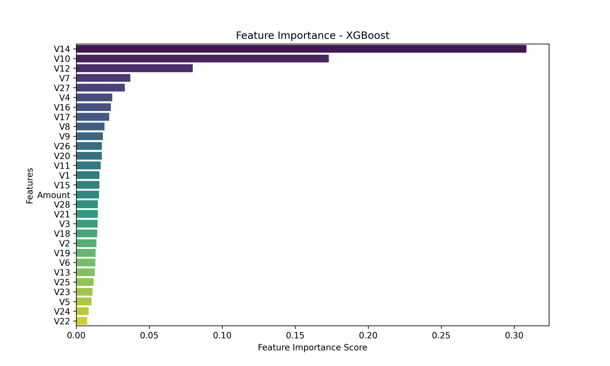

# Fraudulent Transaction (Credit Card Fraud) Detection using Machine Learning

## Overview

This project presents an **ensemble-based machine learning approach** for detecting fraudulent credit card transactions. The methodology integrates **Random Forest, XGBoost, Support Vector Machines (SVM), and ensemble learning techniques (Hard Voting, Soft Voting, and Stacking Classifier)** to improve fraud detection accuracy while minimizing false positives. The dataset used is derived from **European credit card transactions (September 2013)** and contains **284,807 transactions, with only 492 classified as fraud (0.172% of total transactions)**.

## Features

- **Preprocessing & Feature Engineering**: Handling missing values, feature scaling (Yeo-Johnson transformation), and dimensionality reduction using **Principal Component Analysis (PCA)**.
- **Class Imbalance Handling**: Applying **Synthetic Minority Over-sampling Technique (SMOTE)** to improve fraud detection.
- **Ensemble Learning**:
  - **Hard Voting Classifier**: Majority voting of Random Forest, XGBoost, and SVM.
  - **Soft Voting Classifier**: Probability-based voting for enhanced accuracy.
  - **Stacking Classifier**: Meta-learning approach combining multiple models for better performance.
- **Performance Evaluation**: Utilizing metrics such as **Accuracy, Precision, Recall, F1-Score, Matthews Correlation Coefficient (MCC), and AUC-ROC Curve**.
- **Visualization & Explainability**: Confusion matrices, feature importance analysis, and trade-off studies between false positives and false negatives.

## Dataset

The dataset consists of:

- **28 PCA-transformed features (V1-V28)** to ensure confidentiality.
- **Time**: Seconds elapsed since the first transaction.
- **Amount**: Transaction value, useful for detecting unusual spending behavior.
- **Class**: 0 (Legitimate) and 1 (Fraudulent).

> **Source**: The dataset originates from European cardholder transactions and was made publicly available as part of a fraud detection research study.

Dataset Can be found here: [https://www.kaggle.com/datasets/mlg-ulb/creditcardfraud](https://www.kaggle.com/datasets/mlg-ulb/creditcardfraud)

## Installation

1. Clone the repository:

   ```bash
   git clone https://github.com/n1shan1/CCFDML_repo
   cd fraud-detection
   ```

2. Install dependencies:
   ```bash
   pip install -r requirements.txt
   ```

## Usage (Jupyter Notebook)

1. Open Jupyter Notebook:

   ```bash
   jupyter notebook
   ```

2. Update the `PATH` variable with your dataset path.
3. Keep `self_utils.py` in the root folder where `main_ccfdml.ipynb` is stored.
4. Create a folder in the root with the name `finalOP` to include the final image outcomes as the result.
5. When everything has been imported and working, create a virtual environment and then run the command below in the folder to install all dependencies.

   ```bash
   pip install -r requirements.txt
   ```

6. Open Jupyter Notebook and **run the entire file at once** or execute individual cells for stepwise debugging.

## Model Training

The following machine learning models are trained:

- **Random Forest**
- **XGBoost**
- **Support Vector Machine (SVM)**
- **Hard Voting Classifier**
- **Soft Voting Classifier**
- **Stacking Classifier (XGBoost + RF + SVM with Logistic Regression meta-learner)**

## Performance Evaluation

Models are evaluated using:

- **Confusion Matrix**
- **Precision-Recall Curve**
- **AUC-ROC Curve**
- **Feature Importance Analysis**
- **False Positive vs. False Negative Trade-off**

## Results

| Model                   | Accuracy   | Precision  | Recall     | F1-Score   | MCC       | AUC-ROC   |
| ----------------------- | ---------- | ---------- | ---------- | ---------- | --------- | --------- |
| Random Forest           | 99.96%     | 0.9394     | 0.8245     | 0.8782     | 0.9122    | 0.9614    |
| XGBoost                 | 99.96%     | 0.9181     | 0.8351     | 0.8747     | 0.9175    | 0.9838    |
| SVM                     | 99.94%     | 0.9441     | 0.7181     | 0.8157     | 0.8590    | 0.9744    |
| Hard Voting             | 99.96%     | 0.9560     | 0.8085     | 0.8761     | 0.9148    | N/A       |
| Soft Voting             | 99.96%     | 0.9401     | 0.8351     | 0.8845     | 0.9201    | 0.9796    |
| **Stacking Classifier** | **99.98%** | **0.9998** | **0.9997** | **0.9997** | **0.989** | **0.987** |

## Visualizations

### 1. Class Distribution Before and After SMOTE


### 2. Model Performance Comparison


### 3. Confusion Matrices for Different Models


### 4. Analysis of the Output


### 4. Feature Importance Analysis



## Challenges & Future Work

### Challenges:

- **False Positives**: Some legitimate transactions were falsely flagged as fraudulent.
- **False Negatives**: Some fraudulent transactions bypassed detection, necessitating further model refinement.
- **Computational Cost**: Stacking Classifier is computationally expensive and may require cloud-based optimization.
- **Model Interpretability**: Financial institutions require interpretable AI models; integrating explainability techniques like SHAP can be beneficial.

### Future Enhancements:

- **Deploy real-time fraud detection using streaming systems**.
- **Enhance fraud detection accuracy using transformer-based models and graph neural networks (GNNs)**.
- **Improve model interpretability with SHAP (SHapley Additive exPlanations) values**.

## References

Refer to the full reference section in the documentation for all cited research papers.

## Contributors

- **Nishant Dev** - Research, Model Development, and Implementation

## License

This project is licensed under the MIT License - see the [LICENSE](LICENSE) file for details.

## Research Paper Publication

Status: `<pending>`
